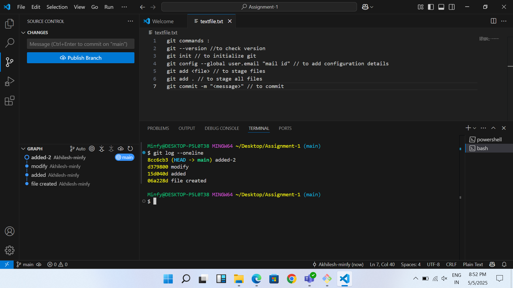

# 📁 Assignment-1 - Git Basics
This repository demonstrates basic Git usage through a set of simple commands and tracked file changes.
## 📄 File(s)
textfile.txt: Contains common Git commands with explanations.
## 📸 Git Log Screenshot

 ## 📝 Commit History with Explanations

Commit Hash Message Description of Change 
- 'added-2' Final update to textfile.txt with extra Git commands. 
- 'modify' Modified the content in textfile.txt (e.g., formatting or adding comments).
- 'added' Added initial list of Git commands to the file.
- 'file' created Created textfile.txt and initialized the content.

